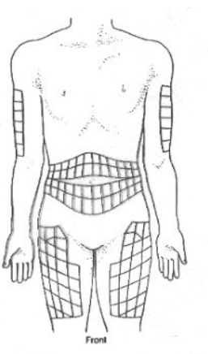

<h1 style='color:rgb(144, 12, 63)'; align=center> Managing Blood Glucose </h1>

# Overview

This repository contains a set of open source tools to help manage blood glucose levels. The goal of this project is to eventually design and build an app that can be used by anyone interested in managing their blood glucose, especially for people who have been diagnosed as having prediabetes or having type 2 diabetes. The app is meant to help people in reducing their blood sugars to the point of being in "remission" of these conditions.

The app will also help type 1 diabetics manage their condition. 

# Problems with existing apps

There are many 'apps' out there already, but here are some pain points with them:

1. Most open source apps are focused on Type 1 diabetes, or focused on using machine learning to make predictions on blood glucose levels. 
2. The apps that come with blood glucose meters, or continuous blood glucose meters (CGM) are proprietary. If you switch the meter brand you use, you'll have to download another app. These apps do not talk to each other and therefore cannot give an aggregated analysis of overall blood glucose levels. They can only give an analysis of blood glucose levels recorded within the app.
3. These apps all have complicated Terms Of Service (TOS) agreements, mostly requiring you to accept that big tech and big pharma can gather and collect data from you, including but not limited to location services, and other health data stored on your device, etc.
4. The graphs and data provided by these apps are not meaningful or insightful. They're not very useful in helping make decisions that can help you manage or reduce blood glucose levels.
5. Apps that connect to software like "Apple Health" means that Apple has access to all your data. Big tech having access to this data means they can profit off of it, instead of you. Your data should be your property, and it should be your decision to sell it and make a profit from it if you chose to do so.
6. Most generic blood glucose apps that are available (at least on the Apple app store) require a paid subscription for services.

# Project goals

The goal of this project are as follows:

1. Track and manage your blood sugars levels.
2. Track and manage finger poking for test trips, CGM sites, and diabetes medication like insulin injections.
3. If you have type 1 diabetes, help you track and manage your blood sugar levels.
4. If you have prediabetes or type 2 diabetes, help you make decisions that will reduce your blood sugar to levels where your diabetes can be considered "in remission".
5. Make data entry simple and easy.
6. Keep your data private while allowing you to share the data with whomever you choose.
7. Meaningful graphs and data visualization

# App features

Below are the features that will be designed and developed:

- [ ] Track blood glucose levels, by date and time, according to a defined set of marker definitions
- [ ] Track meals
- [ ] Track the finger locations used to draw blood samples
- [ ] Track insulin injection locations
- [ ] Track blood pressure
- [ ] Provide graphs and charts that provide meaningful analysis that help make health decisions
- [ ] Use machine learning to predict Hb-A1c levels and trends
- [ ] Create a database to store the data, and use a pipeline to transfer that data to the charts and graphs
- [ ] Make data entry simply and easy, first via an interface but eventually by communicating with blood glucose meters or CGMs
- [ ] Use computer vision to help track meals and snacks

Below are details related to each of these features.

## Tracking blood glucose levels

Blood glucose levels will be tracked by date (YYYY-MM-DD) and time according to the following marker definitions:

| Marker               | Description                           |
|:---------------------|:--------------------------------------|
| **Before Breakfast** | Your blood sugar level before you eat breakfast |
| **After Breakfast**  | Your blood sugar level at least 2 hours after you eat breakfast |
| **Before Lunch**     | Your blood sugar level before you eat lunch |
| **After Lunch**      | Your blood sugar level at least 2 hours after you eat lunch |
| **Before Supper**    | Your blood sugar level before you eat supper |
| **After Supper**     | Your blood sugar level at least 2 hours after you eat supper |
| **Before Snack**     | Your blood sugar level before you have a snack |
| **After Snack**      | Your blood sugar level at least 2 hours after you eat a snack |
| **No Marker**        | A test of your blood sugar level not related to having a meal |

## Meal tracker

Meals will be tracked by date (YYYY-MM-DD) and time according to the following definitions:

| Marker               | Definition                           |
|:---------------------|:--------------------------------------|
| **Breakfast**        | The meal you eat during morning hours, typically before 12:00 Noon |
| **Lunch**            | The meal you eat, typically between 11:00 AM and 2:00 PM |
| **Supper**           | The meal you eat, typically between 4:00 PM and 8:00 PM |
| **Snack**            | Any snack that you eat during the day |

## Finger location tracker

A chart to help track and manage finger pricking used to draw blood for test strips.

## Track insulin injection locations

A chart to help manage and track insulin injection sites.

## Track blood pressure

A chart to track blood pressure, and interpret the results.

## Blood glucose charts

# Background

Insulin resistance and poor metabolic health is the primary driver of many diseases, including:

* Heart Disease and Stroke[^1]
* Blindness[^2]
* Kidney Disease[^3]
* Dementia and Alzheimer's Disease[^4]
* Cancer[^5]

Poor metabolic health, and insulin resistance, is the result of uncontrolled blood sugars (blood glucose). Uncontrolled blood sugar is caused by the consumption of too much refined carbohydrates such as white flour, white rice, and other refined starches, in addition to the consumption of refined sugars like glucose, fructose, and refined corn syrup. Artificial sweeteners can also cause metabolic issues.

## Why managing blood glucose matters to me

On June 20, 2024 I suffered a massive heart attack due to having uncontrolled blood sugars. The Doctor who performed the angiogram that saved my life told me that I survived a "widow maker" heart attack. I needed 2 stents to unplug some clogged arteries and spent 2 weeks recovering in the hospital, waiting for a follow up angiogram to optimize these stents as well as ensure I had no other heart blockages.

The day of my heart attack, my blood glucose levels were 18.2 mmol/L (328 mg/dL), and my Hb-A1c level was 12.0%. The following chart puts these numbers into perspective:

 

The most important lesson I learned while recovering in the Cardio ward of the Hospital was the impact of high blood glucose on heart health. This lesson was not only taught by the attending physicians and nurses, but through my own observations of the people in the Cardiac ward. Almost everyone in this ward had poor metabolic health.

[^1]: Dr. Philip Ovadia [What They Don't Tell You About Statins](https://youtu.be/uUgud92bVK4?si=jF0ITsNBJHOFr8wq)
[^2]: Stoney Williamson, M.D. [Diabetic Retinopathy Treatment in Hattiesburg, Mississippi](https://www.hattiesburgeyeclinic.com/services/eye-conditions/diabetic-retinopathy/)
[^3]: National Kidney Foundation [How are CKD, CVD, and Diabetes Related? | The Kidney Disease, Heart Disease, and Diabetes Connection](https://youtu.be/rLxTozspBxk?si=iyM6R9sl2b6VPEXF)
[^4]: Dr. Ford Brewer [Alzheimer should be called Type 3 Diabetes](https://www.youtube.com/live/SObnLvd-87s?si=6tInkhCgAUM6le0f)
[^5]: Dr. Casey Peavler [The Dangerous Link Between High Blood Sugar, Diabetes, And Cancer](https://youtu.be/GyhI40W0hkc?si=nrrwlPgb8ojiRUMz)
